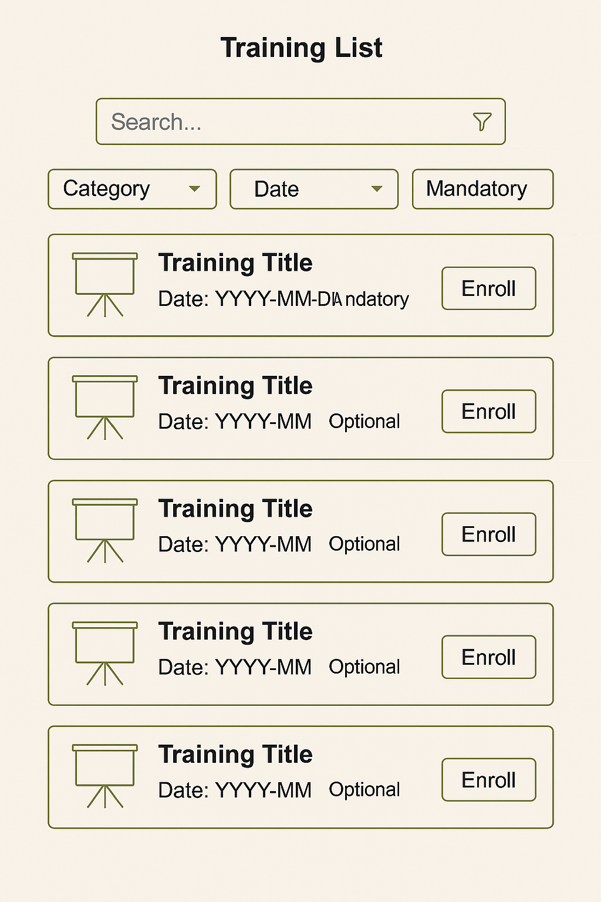

📌 Use Case Diagram — Personnel Performance & Training Tracking System

Aşağıdaki diyagram sistemin temel aktörlerini ve ana kullanım senaryolarını göstermektedir:

[Personel] ----------------------> (Eğitimleri Görüntüleme)

[Personel] ----------------------> (Eğitime Kayıt Olma)

[Personel] ----------------------> (Performans Raporunu Görüntüleme)

[Yönetici] ----------------------> (Performans Değerlendirmesi Oluşturma)

[Yönetici] ----------------------> (Çalışan Performans Raporunu Görüntüleme)

[Yönetici] ----------------------> (Eğitim Önerilerini Görüntüleme)

[Eğitim Departmanı] ------------> (Eğitim Oluşturma)

[Eğitim Departmanı] ------------> (Eğitim Planlaması)

[İK Departmanı] ----------------> (Personel Kaydı Yönetme)

[Sistem] ------------------------> (Otomatik Eğitim Önerisi)

