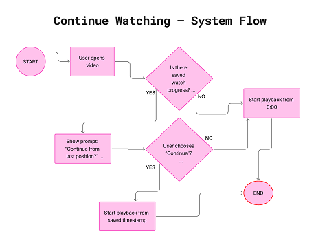
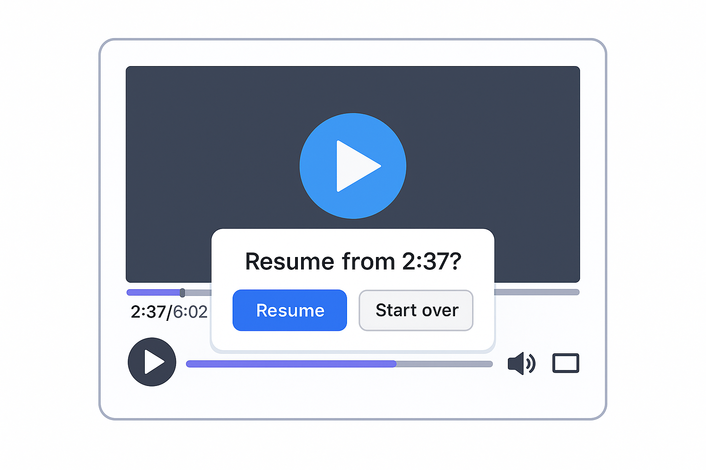
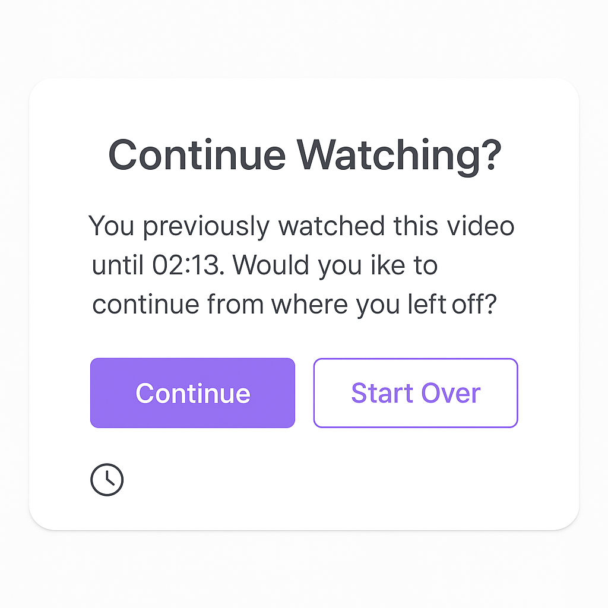

# 🎬 Video Watching Module – Business Analysis

This module describes how users watch, pause, and continue videos inside an e-learning platform.  
The focus of this analysis is the **“Continue Watching”** feature, progress tracking, and a seamless video playback experience.

---

## 📌 1. Overview

The Video Watching Module enables users to:
- Watch selected content
- Automatically save watch progress
- Resume videos from the last watched timestamp
- Track completed or ongoing videos
- View recently watched content

This module is essential for user engagement, retention, and overall learning continuity in digital platforms.

---

## 🧩 2. User Stories

**US-01 – Watch Video**  
As a user, I want to watch a selected video so that I can follow the lesson or content.

**US-02 – Auto-Save Progress**  
As a user, I want the system to automatically save my watch progress so that I don’t lose my place.

**US-03 – Continue Watching**  
As a user, I want to continue watching from where I left off so that I don’t waste time finding my place.

**US-04 – View Last Watched Videos**  
As a user, I want to see a list of my recently watched videos so I can quickly resume learning.

**US-05 – Completion Tracking**  
As a user, I want the system to mark videos as completed so I can measure my learning progress.

---

## ✔️ 3. Acceptance Criteria

### **AC for US-02 – Auto-Save Progress**
- System auto-saves the timestamp every 10 seconds  
- System saves progress when user closes the video  
- System updates timestamp when user seeks forward or backward  
- Saved progress is stored in user profile  

### **AC for US-03 – Continue Watching**
- If progress > 0, system displays “Continue from last position?”  
- If user clicks **YES**, video resumes from saved timestamp  
- If user clicks **NO**, video starts from the beginning  
- If progress = 100%, system shows the “Completed” state  

---

## 🔍 4. Use Case – Continue Watching

**Actor:** User  
**Precondition:** User has a saved watch progress

**Main Flow:**  
1. User opens video  
2. System checks saved timestamp  
3. System displays continue prompt  
4. User selects option  
5. System starts playback accordingly  

**Alternate Flow:**  
- No saved progress → Start at 0:00  
- Progress = 100% → Show “Rewatch” option  

---

## 🔄 5. System Flow (Flowchart)
### 📌📺 Continue Watching – System Flow

  

  ##### *This system flow outlines how the video player determines whether to resume playback from a previously saved timestamp or start from the beginning. It captures the decision-making logic behind the Continue Watching experience, ensuring seamless user interaction and consistent playback behavior. Diagram created in FigJam.*
---

## 🖼️ 6. Wireframes
📌 ***Sample Wireframes***
- Video Player UI  
- Continue Watching Modal  
#### Video Player with Resume Indicator

  

#### Continue Watching Modal

  

---

## ⭐ 7. Business Value / Improvements

This feature improves:
- **User retention** (users return to unfinished content)  
- **Platform engagement** (easier navigation)  
- **UX quality** (no need to manually search playback point)  
- **Operational efficiency** (fewer support tickets regarding “video reset” issues)  

Future improvements may include:
- Personalized recommendations based on progress  
- Progress sync across multiple devices  
- Offline watch progress synchronization  

---

## 📁 Folder Structure (for this module)
Video-Watching-Module/
│

├── README.md

├── use-case/

│ └── continue-watching-usecase.md

├── user-stories/

│ └── user-stories.md

├── flowcharts/

│ └── video-module-flow.png

└── wireframes/

├── video-player.png

└── continue-modal.png

---

If you want to explore the rest of my Business Analysis work, you can visit my full portfolio 👇  
🔗 **https://github.com/tubalptekin/tugba-alptekin-BA-Portfolio**

