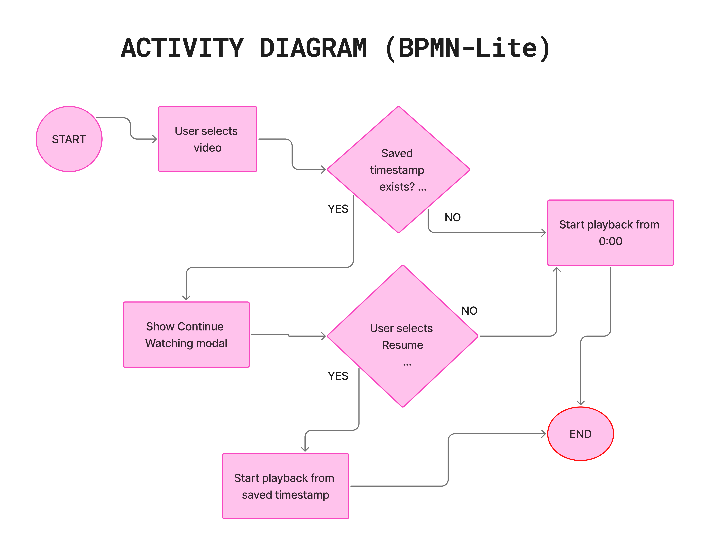

# *ACTIVITY DIAGRAM*
 ##### *This flow outlines how the video player determines whether to resume playback from a previously saved timestamp or start from the beginning. It captures the decision-making logic behind the Continue Watching experience, ensuring seamless user interaction and consistent playback behavior. Diagram created in FigJam.*

  

# Use Case: Continue Watching 🎬

Use Case ID: UC-VW-01

Module: Video Watching

Actor: Logged-in User

### Preconditions:

- Kullanıcı giriş yapmış olmalı.

- Sistemde ilgili video için kayıtlı bir izleme zaman damgası olabilir.

### Postconditions:

- Kullanıcının seçimine göre video 0:00’dan veya kayıtlı zaman damgasından başlatılır.

- Seçim loglanır (isteğe bağlı analytics).

## Main Flow

User selects a video from the platform.

System checks if the user has previously watched this video.

System identifies a saved timestamp (if any).

System displays a Continue Watching prompt.

User chooses either:

Resume → Video saved timestamp’ten oynar

Start Over → Video 0:00’dan başlar

## Alternative Flows

A1 – No saved timestamp exists
3a. Eğer önceki izleme kaydı yoksa:
→ System automatically starts playback from 0:00

A2 – User closes the modal
5a. Kullanıcı modalı kapatır veya karar vermez
→ Default: Playback starts from 0:00

A3 – Playback failed
6a. Video yüklenemez
→ System displays an error message

Exceptions

E01: Timestamp corrupted → Reset to 0:00

E02: Network error → Retry option is shown

# ACCEPTANCE CRITERIA (Gherkin Format)

### Scenario 1: 
Show continue watching modal

Given the user is logged in

And a saved timestamp exists for the selected video

When the user opens the video

Then the system should display the “Continue Watching” modal

And the modal should show the saved timestamp

### Scenario 2: 
Resume from saved timestamp

Given the user sees the Continue Watching modal

When the user clicks “Resume”

Then playback should start from the saved timestamp

### Scenario 3: 
Start over

Given the user sees the Continue Watching modal

When the user clicks “Start Over”

Then playback should start from 0:00

### Scenario 4: 
No saved progress

Given no saved timestamp exists for the video

When the user opens the video

Then playback should start from 0:00 immediately
