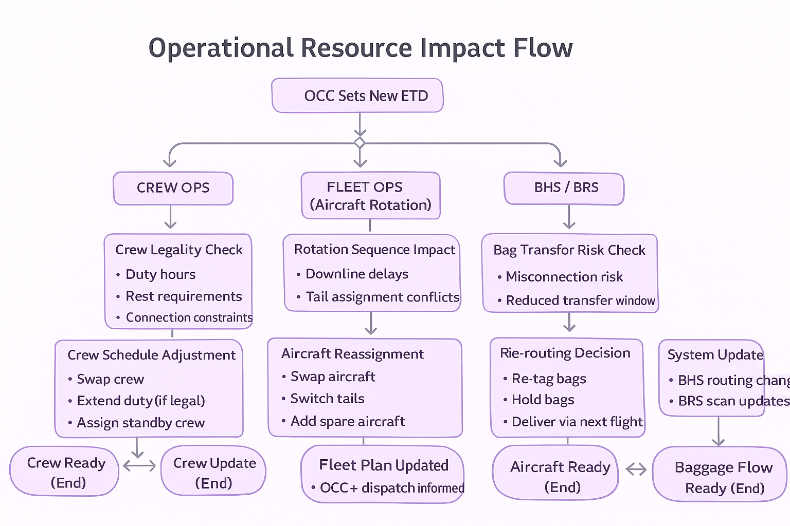

# 🧩 Operational Resource Impact Flow

This diagram shows how delay propagation affects Crew Operations, Fleet / Aircraft Rotation, and Baggage Handling Systems (BHS/BRS).
Each resource group evaluates operational constraints and ensures readiness before the new ETD.

  

🔍 Key Points (From a BA Perspective)

👨‍✈️ Crew Operations

Crew legality must be revalidated (duty hours, rest limits).

Any violation triggers crew replacement or rerouting.

Output → Crew Ready

## ✈️ Fleet / Aircraft Rotation

Delay may cause downstream rotation conflicts.

Maintenance windows must be rechecked (MELs, A-check slot).

Output → Aircraft Ready

## 🎒 Baggage Handling (BHS/BRS)

Risk of misconnection increases with delay.

System evaluates if bags must be held, retagged, or rerouted.

Output → Baggage Flow Ready

## ⭐ Why This Matters

Operational resources are the backbone of airline performance.

A small delay can:

break crew legality,

disrupt rotation chains,

cause missed baggage transfers.

A Business Analyst must:

identify dependencies early,

map system interactions,

ensure OCC decisions reflect real operational constraints.
