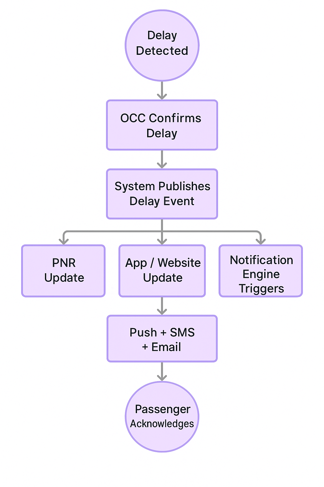
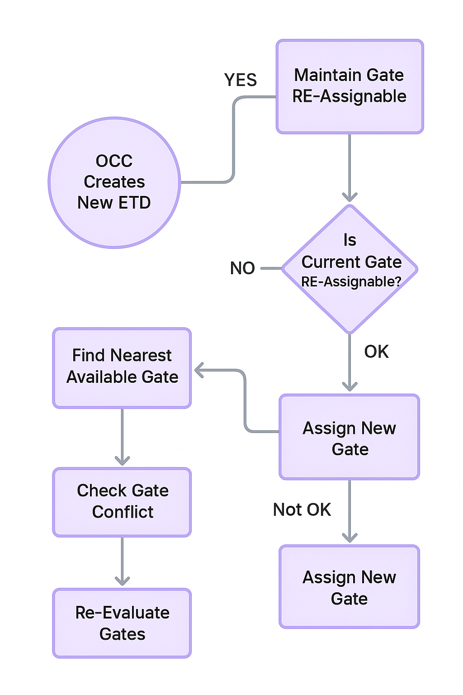
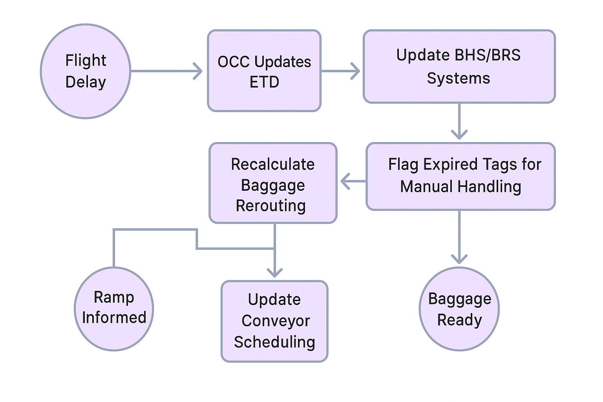

## 🌀 High-Level Operational Flow

This diagram illustrates the end-to-end operational flow triggered when a flight delay is detected, showing how OCC, airport operations, passenger systems, and resource management respond in parallel.

  

What this flow represents

The delay event is detected in real-time

OCC evaluates operational impact

A new ETD is defined and published

Passenger notification, gate reassignment, and resource recalculation occur simultaneously

Ensures operational alignment across all systems

## 🛬 Gate Assignment Flow

This flow illustrates how the Operations Control Center (OCC) re-evaluates and updates the gate assignment after a delay event.
It ensures gate availability, prevents gate conflicts, and keeps airport operations synchronized.

  

What this flow represents

Checking for gate conflict after delay

Availability check for new time slot

Updating FIDS and airport-side systems

Coordinating with ramp/ground operations

Ensuring a smooth passenger boarding flow

## 🧳 Baggage Handling Flow (BHS / BRS)

This flow shows how flight delays impact the baggage handling system — especially routing logic, conveyor timing, and transfer bag coordination.

  

What this flow represents

Recalculating baggage routing based on new ETD

Preventing misrouting or early dispatch

Ensuring transfer bags do not miss connections

Updating BRS scans and baggage belt timing

Coordination between ramp agents and baggage teams

### ✅ Summary

These three diagrams visualize how flight delays trigger a multi-layer operational response involving:

OCC decision-making

Passenger communication

Airport infrastructure updates

Crew & resource recalculations

Baggage system coordination

They form the foundation for the use cases, user stories, and system interaction diagrams in later sections.
