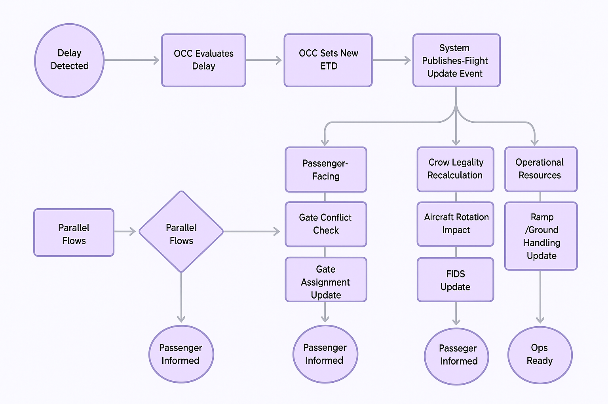
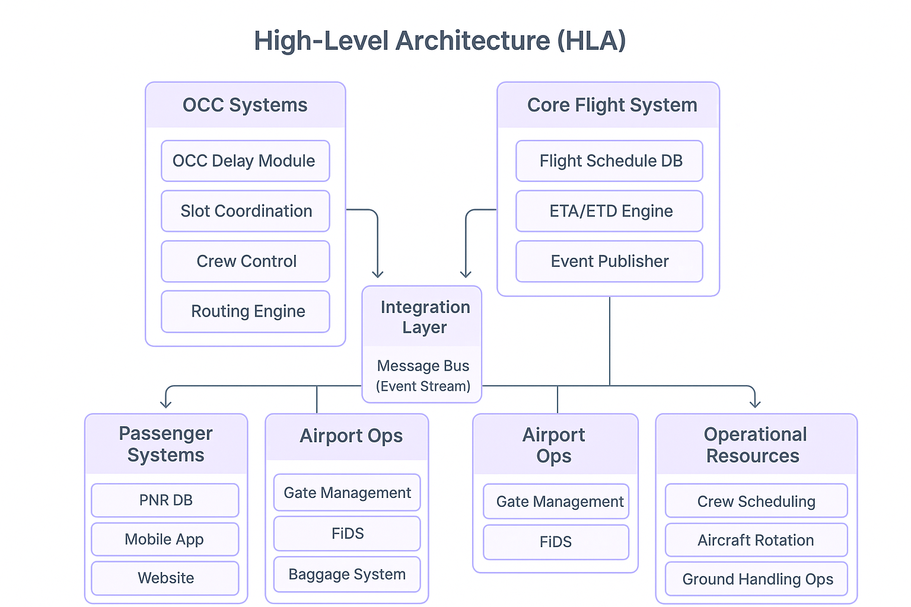
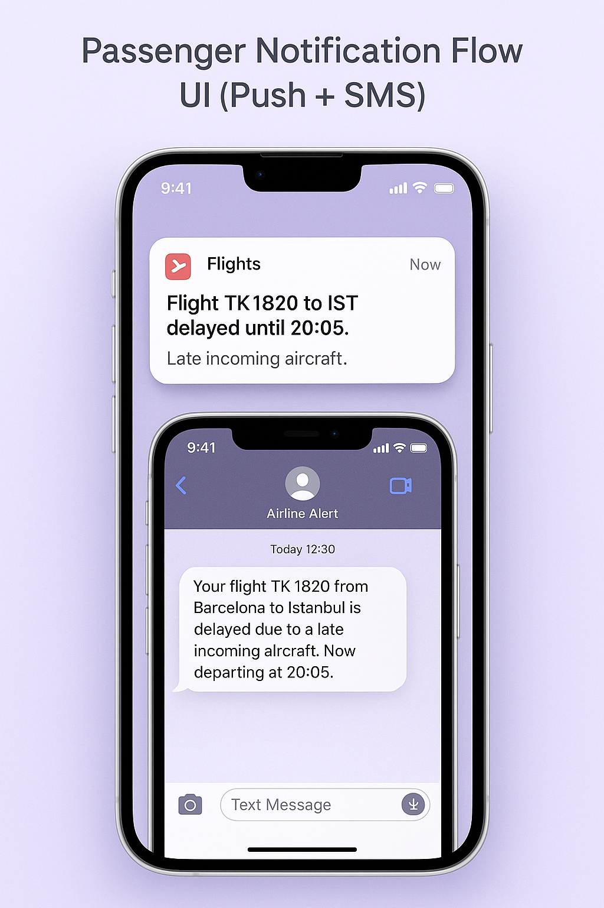
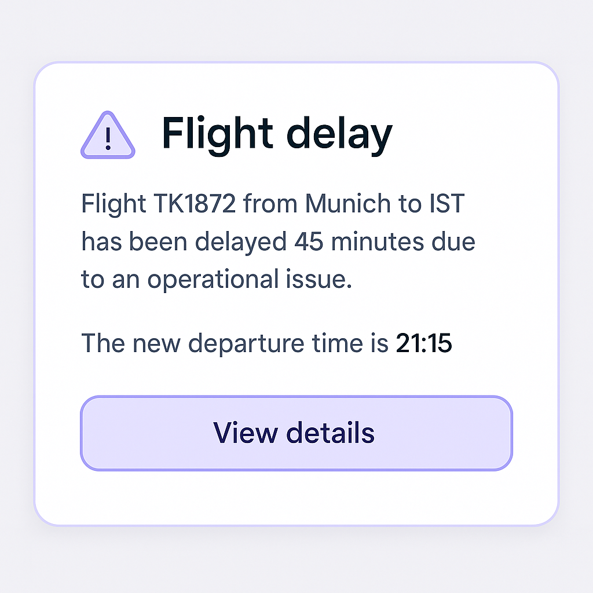

  

# ✈️ Flight Disruption Management — Business Analysis Case Study
*A sector-focused project analyzing one of the most critical operational & technical processes in aviation: Flight Disruption Management.*

In aviation, even a **5-minute delay** can impact:
- hundreds of passengers,
- dozens of operational teams,
- real-time data systems,
- airport coordination,
- baggage routing,
- crew planning and aircraft assignments.

This project explores the **end-to-end flow** of managing flight delays from a **Business Analyst** perspective, including:

### 🔹 Passenger communication (SMS / Push / E-mail)
### 🔹 Flight re-scheduling & OCC decision making
### 🔹 Crew – aircraft – gate assignment logic
### 🔹 Baggage handling system impact (BHS / BRS)
### 🔹 Airport operations coordination
### 🔹 Alternative scenarios & edge cases

 

---

## ✈️ High-Level Delay Handling Flow

This flow illustrates how a detected delay propagates across multiple operational domains  
(OCC, Passenger Systems, Airport Ops, and Operational Resources).

  

---

## 🏗 High-Level Architecture (HLA)

The architecture below shows how operational systems interact  
when a delay update is published from the OCC.

  

## 🎯 Objective

This case study aims to demonstrate how a Business Analyst approaches operational disruption,
evaluates system impact areas, and designs a structured solution to minimize passenger inconvenience,
operational cost, and cascading delays.
To demonstrate analytical thinking, system interaction understanding, and solution-oriented analysis for aviation operations — especially for teams like Turkish Airlines.

 

---

## 🖥 Sample UI Screens 
### 📱 Passenger Notification UI Mockup

Below is a sample passenger-facing UI that demonstrates how a delay update is communicated via mobile push notifications and SMS channels.

  

### 🛫 Passenger Rebooking UI 
This screen shows how passengers can view available alternative flights, accept rebooking offers, or request compensation depending on regulations.

  

## 📌 Scope

This analysis covers:
- Delay propagation and operational impact
- Passenger-facing updates and notification logic
- Gate, crew, and aircraft assignment impacts
- System-to-system communication during disruption

## 🚫 Out of Scope

This analysis does ***not*** cover:
- Airline pricing logic
- Maintenance delay root-cause analysis
- Weather forecasting systems

## 📚 Key Insights

- Even small delays create multi-system ripple effects (PNR, FIDS, Gate Ops, Crew legality).
- A structured notification + resource recalculation strategy reduces passenger frustration.
- Standardizing disruption-handling events improves OCC efficiency and reduces operational risk.

## 📁 Project Structure (This folder will include)
01-Scope-and-Actors

02-Use-Cases

03-Process-Flows

04-UserStories-AcceptanceCriteria

05-System-Interaction-Diagram

06-Risks-and-Mitigation

Each section will be added step-by-step with diagrams, flows, use cases, and acceptance criteria.

---

## ✨ Author
***Tuğba Alptekin***
Junior Business Analyst | MIS Graduate  
Focused on Aviation, Technology, and Process Optimization  
